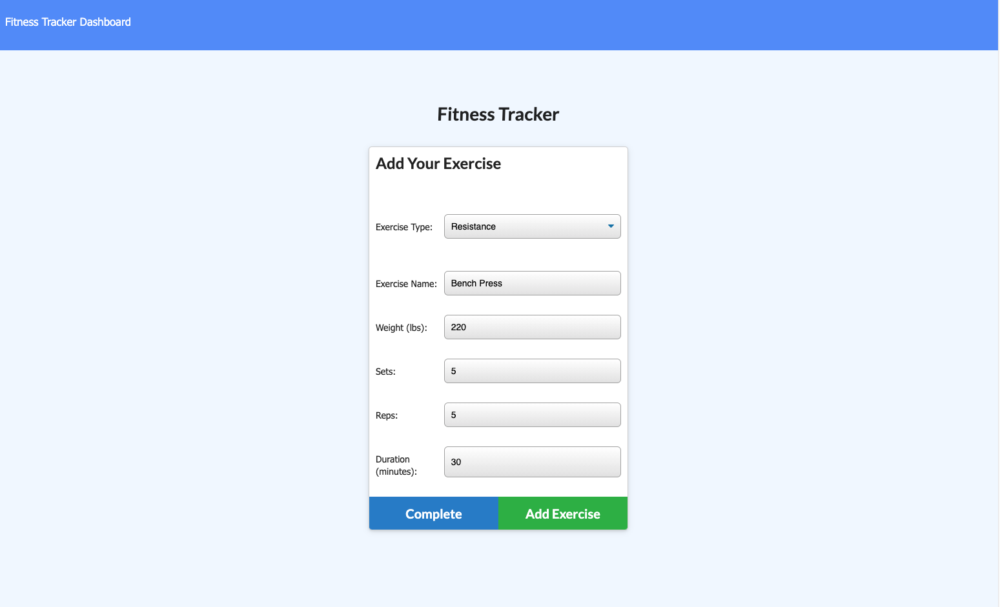
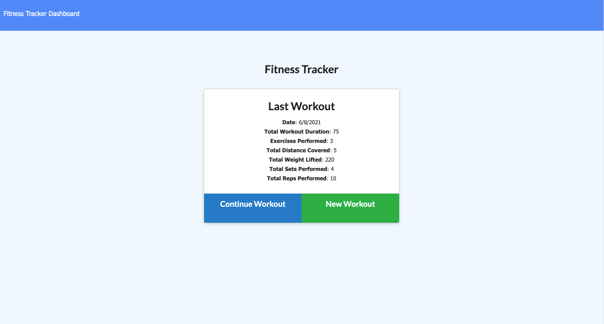
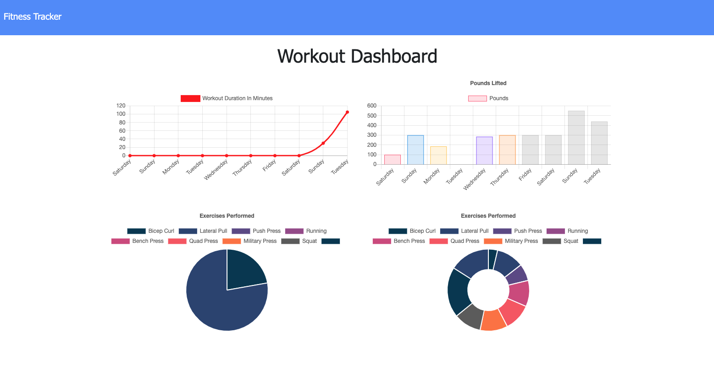

# Workout-Tracker

## Table of Contents

1. [Overview](#overview)
2. [Site Links](#site-links)
3. [Website Demo](#demo)
4. [Technologies Used](#technologies-used)
5. [License](#license)
6. [Let's Connect!](#connect)

</br>
<p align="center">
    
    
    
    
    
    
    
      
      
      
</p>

<a name="overview"></a>

## 1. Overview

```
As a user, I want to be able to view create and track daily workouts. I want to be able to log multiple exercises in a workout on a given day. I should also be able to track the name, type, weight, sets, reps, and duration of exercise. If the exercise is a cardio exercise, I should be able to track my distance traveled.
```

<a name="site-links"></a>

## 2. Site Links

- [github repository site] https://github.com/TakuyaMats/Workout-Tracker.git

- [live site] https://git.heroku.com/enigmatic-beach-93573.git

<a name="demo"></a>

## 3. Website Demo





<a name="technologies-used"></a>

## 4. Technologies Used

<p align="center">
    <a href="https://developer.mozilla.org/en-US/docs/Web/HTML"></a>
    <a href="https://developer.mozilla.org/en-US/docs/Web/CSS"></a>
    <a href="https://www.javascript.com/"></a>
    <a href="https://getbootstrap.com/"></a>
    <a href="https://nodejs.org/en/"></a>
    <a href="https://www.npmjs.com/package/express"></a>
    <a href="https://www.mongodb.com/"></a>
</p>

<a name="license"></a>

## 5. License

[](https://github.com/git/git-scm.com/blob/main/MIT-LICENSE.txt)

<a name="connect"></a>

## 6. Let's Connect!

[](https://github.com/TakuyaMats)
[](https://www.linkedin.com/in/takuyamatsumoto90/)
